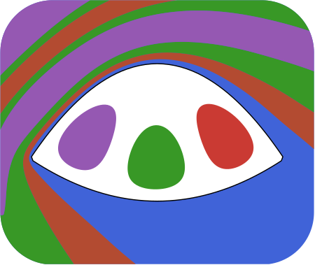

<!-- class="center"/> -->

+ [Overview](./docs/overview)
  + [Geometry](./docs/geometry)
  + [Lattices](./docs/lattice)
+ Tutorials
  + [Photonic Crystal](./docs/tutorials/photonic)
  + [Beam Splitter & Bragg Mirror](./docs/tutorials/mirror)
  <!-- + [Photonic Crystal](./docs/tutorials/photonic) -->

The [source code](https://github.com/biestro/BoundaryWall.jl) is available on github.

### More posts: