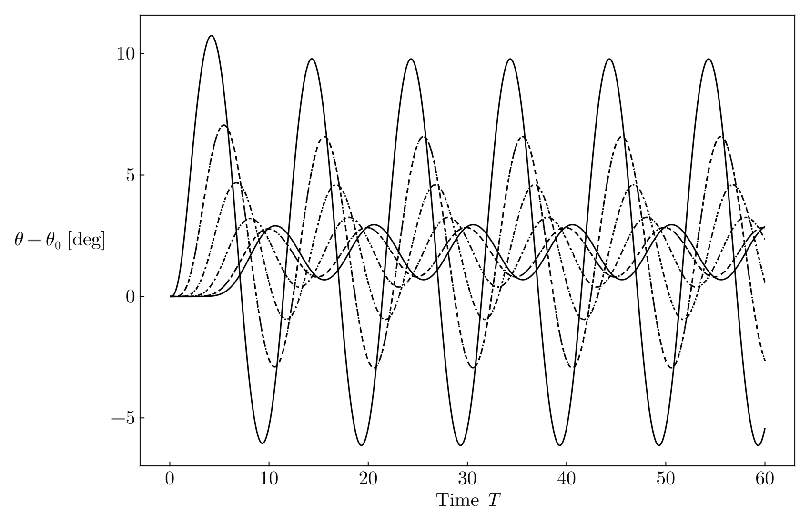

## Derivation and examples

WORK IN PROGRESS

\[
  T = \begin{bmatrix}
    2k & -k & 0 & \cdots & -k \\
    -k & 2k& -k & \cdots & 0 \\
    0 & -k & 2k & \cdots & 0 \\
    \vdots & \vdots & \vdots & \ddots & -k \\
   -k & 0 & 0 & -k & 2k
\end{bmatrix}
\]

The solution for the displacements follows the picture below.

The periodic chain behaves as the following video shows.



One can also rearrange this chain into a circle in order to improve our visualization of periodic boundary conditions (PBC); another reason why we call the variable to be \(\theta\).



This works as an approximation for a chain of springs arranged in a 1D patter only for large \(N\), as we are making the assumption that \(d
\approx r\theta\). We also set unit radius (just for simplicity).

## Non-homogeneous springs

One can, however, wonder what happens one removes the homogeneity of the stiffness matrix. What do I mean by this? Consider two sets of oscillators, both driven by a function \(F_0\delta_{0,j}\cos(\omega_D t)\) (i.e. acts only on the first mass), but whose stiffness constant between \(m_i\) and \(m_{i+1}\) is set to be variable.

\[
  T = \begin{bmatrix}
    k_N+k_1 & -k_1 & 0 & \cdots & -k_N \\
    -k_1 & k_1 + k_2 & -k_2 & \cdots & 0 \\
    0 & -k_2 & k_2 + k_3 & \cdots & 0 \\
    \vdots & \vdots & \vdots & \ddots & -k_{N-1} \\
   -k_N & 0 & 0 & -k_{N-1} & k_{N-1}+k_{N}
\end{bmatrix}.
\]

We see that the case \(k_i=k\;\forall_i\) gives the same matrix as in the previous section. We also set the frequency to be extremely low. The following animations show the comparison for the homogeneous case and a particular non-homogeneous matrix, where one constructs the stiffness matrix out of a stiffness vector
\[\mathbf{k}=[ {\color{olive}k_1}, {\color{teal}k_2}, {\color{olive}k_1},  {\color{teal}k_2},{\color{olive}k_1},\dots].\]
I denote this as \(n-\)periodicity, where for the example above, we had a 2-periodic vector.

<!--  -->


There appears to be a noticeable grouping by pairs of masses. One can also plot the 1D chain for the previous model, and it appears to exhibit much more unpredictable behaviour than the homogeneous case. The following examples are for a 3-periodic chain (i.e. \([k_1,k_2,k_3,k_1,k_2,k_3,\dots]\)).



Making the force act on two masses in the system makes the effect be more noticeable.



<!--  -->

### More posts:
