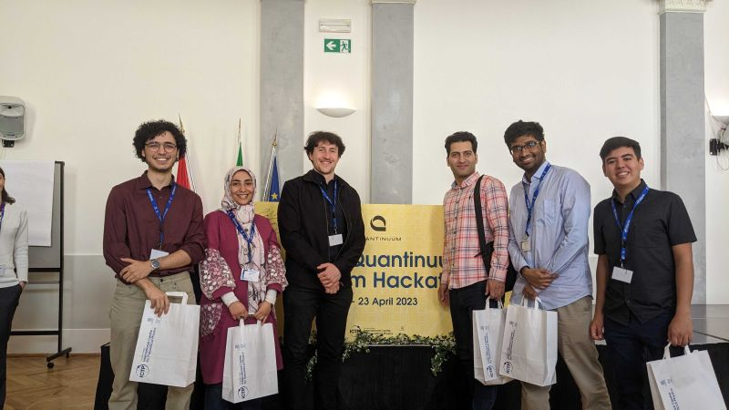

[We won! (second place)](https://www.ictp.it/news/2023/4/hackathon-prize-winners-announced). After a week of lectures and 48 hours of intense coding and learning, I'm proud to announce that our team was awarded the **Best Team Project** prize by [Quantinuum](https://www.quantinuum.com/) and the [International Centre for Theoretical Physics](https://www.ictp.it/).

From the [event's website](https://indico.ictp.it/event/10163), "*The ICTP-Quantinuum Quantum Hackathon invites 18 international teams of students to the International Centre for Theoretical Physics to learn and develop quantum algorithms and apply them in the context of real-world use-cases with leading industrial partners.*" 

## The challenge

My team and I worked on Quantum Krylov Methods with our mentor, [Nathan Fitzpatrick](https://scholar.google.com/citations?user=M9JDf6sAAAAJ) (from Quantinuum), in order to simulate an H\(_2\) molecule (it can be applied to other chains). This provided a significant advantage over a *variational* approach (as it is usually seen in tutorials for quantum computing in chemistry), as the algorithm is purely quantum.

Another advantage comes from the fact that with *variational* algorithms, your aim is to only calculate the ground state. With this method, however, we are able to reproduce excited state curves "for free". These excited states come from the fact that this is a generalized eigenvalue problem in Krylov subspace, which is (supposed to be) much smaller than the total Hilbert space from the original diagonalization problem 

\[H|\psi\rangle=E|\psi\rangle\]

A small issue with the "pure" Krylov Method (we used a Unitary Krylov Approach) is that, as your Krylov basis is purely in powers of functions of \\(H\\), e.g.

\[\{|\psi_0\rangle, f(H)^1|\psi_0\rangle,f(H)^2|\psi_0\rangle, ..., f(H)^K|\psi_0\rangle \} \]

the basis becomes almost linearly dependent due to the *properties of power iteration*. This can be solved through an orthogonalization routine, as seen in [this paper](https://arxiv.org/abs/2208.00567) that was published just after the hackathon. They use the Krylov space as a basis for the Lanczos method.

We used [InQuanto](https://www.quantinuum.com/computationalchemistry/inquanto), from *Quantinuum* in order to get the second quantization as a weighted linear combination of unitary Paulis (through the JW-transformation). 

## Photo

