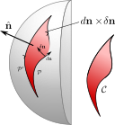

This was a problem in my final exam for the Classical Mechanics course imparted by the wonderful Kaden Hazzard. I will 
attempt to describe its solution (thank you Kaden for the exam and solution manual on part *b*!)

## Statement
Symmetries are useful for constructing Lagrangians (for an example see, my post on [mean field](../mean-field/)). The 
Lagrangian for this system is 

\[
\mathcal{L}=i\sum_a w^*_a\partial_t w_a - c^2\sum_j\partial_j \vec{n}\cdot\partial_j\vec{n},
\]

where \(\partial_j\equiv\partial/\partial x_j\), and \(w(\vec{x}, t)\) is a two-component field, which is nothing new if you've done any field theory in classical mechanics (Stone's book on mathematical methods [^1] is a good reference for this). The first term represents the kinetic energy and the last term is clearly potential energy. 

Using the regular Euler-Lagrange equations is not always the most straightforward route, as highlighted by this problem. Instead, we perform the variation by hand. Let us take for a fact now (part *b* deals with this) that the variation for the kinetic term is 

\[
  \int dt\delta \left(
    \sum_a w^*_a\partial_t w_a
  \right) = \frac{i}{2}\int dt\;\delta \vec{n}\cdot (\vec{n\times\partial_t\vec{n}})
\]

Performing a variation in the potential energy will give the expected Euler-Lagrange equation,

\[
\begin{aligned}
\delta S_n&=\frac{\partial \mathcal{L}}{\partial n} - \frac{\partial}{\partial t} \left( \frac{\partial \mathcal{L}}{\partial \dot{n}} \right) - \frac{\partial}{\partial x_j} \left( \frac{\partial \mathcal{L}}{\partial (\partial_{j} n)} \right),\\
&=\frac{\partial \mathcal{L}}{\partial n} - \frac{\partial}{\partial t} \left( \frac{\partial \mathcal{L}}{\partial \dot{n}} \right) - \nabla\cdot \left( \frac{\partial \mathcal{L}}{\partial (\nabla n)} \right)
\end{aligned}
\]

and so 

\[
\begin{aligned}
\partial\mathcal{L}/\partial{\vec{n}}&=0,\\
\partial\mathcal{L}/\partial{\dot{\vec{n}}}&=0,\\
\frac{\partial\mathcal{L}}{\partial{\nabla{\vec{n}}}}&=2c^2\nabla \vec{n}.\\
\end{aligned}
\]

To see why the last term is twice \(\nabla \vec{n}\), try to do the derivative \(\partial_{\vec{v}} (\vec{v}\cdot\vec{v})\).

The total variation is then

\[
\begin{aligned}
  \delta S &= \delta \left(\int\;dt \; dx\; T\right) - \delta \left(\int\;dt \; dx\; U\right) \\
  x &= y + z
\end{aligned} 
\]

  

    

      Lorem ipsum dolor sit amet, consectetur adipiscing elit. Sed do eiusmod tempor incididunt ut labore et dolore magna aliqua. 
      Ut enim ad minim veniam, quis nostrud exercitation ullamco laboris nisi ut aliquip ex ea commodo consequat.
    

  

  

    
  

[^1]: Stone, Michael, and Paul Goldbart. *Mathematics for Physics: A Guided Tour for Graduate Students*. Cambridge University Press, 2009.

### More posts:
